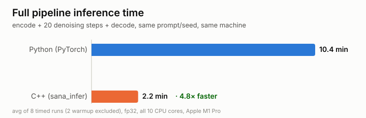

<h1 align="center">sana.cpp</h1>

<p align="center">
  A minimalistic C++ implementation of <a href="https://github.com/NVlabs/Sana">Sana</a>'s (0.6B) text-to-image
  inference pipeline optimized for Apple Silicon
  CPU — <strong>~4.8x faster than the PyTorch pipeline on Apple Silicon CPU </strong>
</p>

<p align="center">
  
  
  
  
</p>

<p align="center">
  
  
  
  
  
  
</p>

<p align="center">
  
</p>

## Contents

- [Contents](#contents)
- [Getting started](#getting-started)
- [What's here](#whats-here)
- [Benchmarking: Python vs C++](#benchmarking-python-vs-c)
- [Tests](#tests)
- [Project layout](#project-layout)
- [License](#license)

## Getting started

Requirements: CMake >= 3.16, a C++17 compiler, and macOS on Apple Silicon
(the primary target — it links against the `Accelerate` framework and builds
with `-mcpu=native`; a non-Apple `-march=native` path exists but is less
exercised). `llama.cpp`/`ggml` aren't vendored as source — they're pulled
automatically at configure time via CMake `FetchContent`, pinned to a fixed
tag, so a plain `cmake` invocation is enough to fetch them.

1. **Build:**

   ```sh
   cmake -S . -B build
   cmake --build build -j
   ```

   This produces `sana_infer`, `bench_full_pipeline`, and the unit-test
   binaries, all under `build/`.

2. **Get the model weights.** `sana_infer` reads weights from a directory of
   `.gguf` files (default `../weights` relative to the build directory). Pre-converted files
   are hosted at
   [doobluhc/sana-cpp-weights](https://huggingface.co/doobluhc/sana-cpp-weights)
   — fetch them with plain `curl`, no Python required:

   ```sh
   ./download_weights.sh weights
   ```

3. **Run inference:**

   ```sh
   cd build
   ./sana_infer --prompt "a house by the lake" --output out.png
   ```

   Run `./sana_infer --help` for the full option list (`--negative-prompt`,
   `--steps`, `--seed`, `--guidance`, `--weights-dir`, `--gemma-gguf`, ...).

   Python 3 with `torch` and `diffusers` is only needed if you also want to
   run the PyTorch reference benchmarks below — not for any of the steps
   above.

## What's here

- **Gemma-2 text encoder** (`src/gemma_encoder.*`) — runs on the vendored
  [llama.cpp](https://github.com/ggml-org/llama.cpp)/`ggml` inference engine.
- **Transformer denoiser** (`src/transformer*.*`) and **DPM-Solver++ scheduler**
  (`src/scheduler.*`) — the diffusion denoising loop.
- **VAE decoder** (`src/vae*.*`) — turns final latents into an image.
- **`sana_infer`** (`src/infer_main.cpp`) — the CLI that chains all three
  stages end to end and writes a PNG/PPM.
- **`bench_full_pipeline`** (`tests/bench_full_pipeline.cpp`), paired with
  `tools/bench_reference_full_pipeline.py`, so the whole pipeline's inference
  speed can be timed and compared directly against the PyTorch reference.

## Benchmarking: Python vs C++

The whole pipeline (encode + denoise + decode) can be timed on both
implementations, on the same inputs, and compared directly:

| Stage | C++ | Python reference |
|---|---|---|
| Full pipeline (encode + denoise + decode) | `./bench_full_pipeline <warmup> <iters>` | `python3 tools/bench_reference_full_pipeline.py` |

## Tests

```sh
ctest --test-dir build --output-on-failure
```

Runs the self-contained unit tests (tensor ops, transformer block, scheduler,
Gemma-2 encoder) — none of them need model weights or any external fixture
data.

## Project layout

```
src/                  C++ library + sana_infer CLI
tests/                self-contained unit tests + the full-pipeline benchmark
tools/                the PyTorch full-pipeline benchmark
download_weights.sh   fetches pre-converted .gguf weights from Hugging Face
```

## License

MIT — see [`LICENSE`](LICENSE).

This covers the code in this repo only. The Sana model weights themselves
are published separately by NVIDIA/Efficient-Large-Model under their own
terms — check
[the upstream model's license](https://huggingface.co/Efficient-Large-Model/Sana_600M_1024px_diffusers)
before using them.
